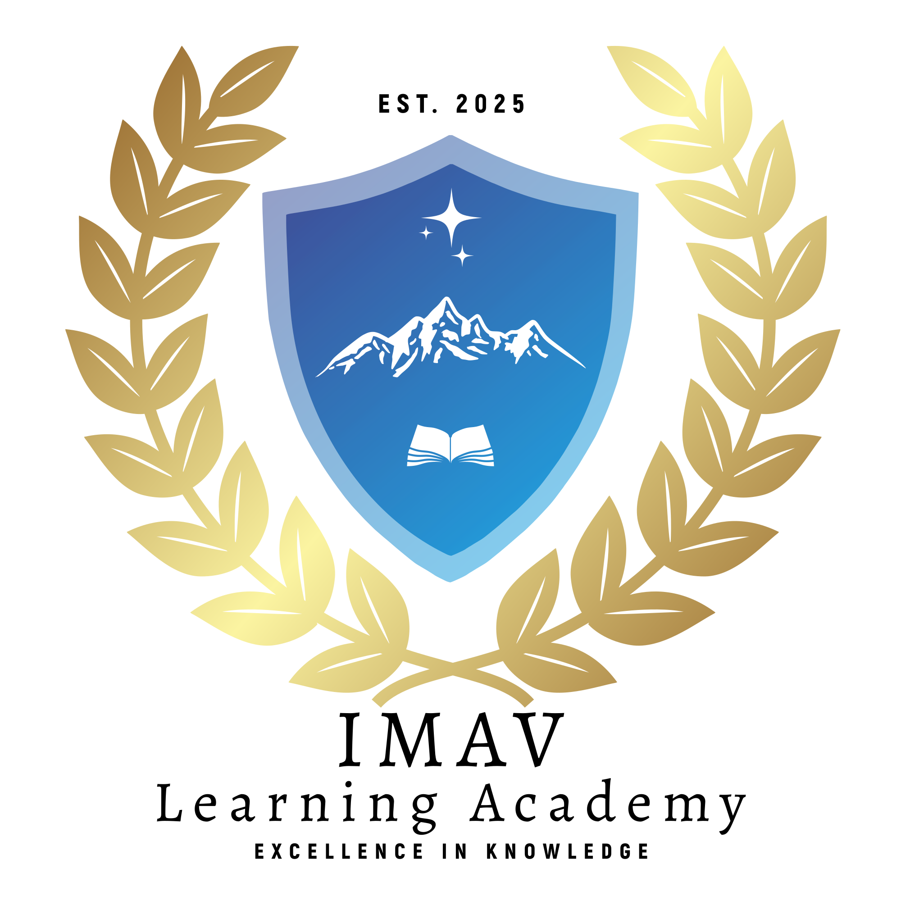

  

<h1 align="center">Welcome to IMAV Learning Academy Pvt Ltd</h1>

  <em>Empowering Learners with In-Demand Tech Skills Through Quality Online Education</em>

---

## 👋 About Us

IMAV Learning Academy Pvt Ltd is a newly registered Edtech company committed to delivering high-quality, accessible online training. We operate as a fully online platform, offering live, instructor-led courses designed to equip students with practical skills for the modern workforce.

We pride ourselves on our commitment to quality and standards, demonstrated by our certifications and accreditations:
* **ISO Certified:** 9001 (Quality Management), 14001 (Environmental Management), 21001 (Educational Organizations Management), 27001 (Information Security), 29993 (Learning Services outside Formal Education)
* **Accredited by:** In Progress....

## 📚 Our Courses

We provide a wide array of courses across various technology domains and learning levels:
* **Levels:** Foundational, Essential, Professional, Bootcamps, Workshops, Seminars, and Professional Projects.
* **Topics Include:**
    * Web Development (HTML, CSS, JavaScript, Node.js, React.js, Django, Flask, Web Designing)
    * Programming Languages (Java, Advanced Java, Python, C, C++)
    * Data Science, Machine Learning & AI
    * Cloud Computing (AWS, Azure, Oracle Cloud, Google Cloud)
    * Databases (SQL, MongoDB)
    * DevOps, CI/CD & Version Control (Git, GitHub)
    * Networking
    * Electronics, IoT & Automation

## ✨ Why Choose IMAV Learning Academy?

* **Live Instructor-Led Classes:** Engaging sessions (2 days/week, 1.5-2 hours each) taught by experienced professionals.
* **Flexible Scheduling:** Multiple daily batches (7 am, 3 pm, 5 pm, 7 pm IST) to fit your routine. New courses start on the 1st of every month.
* **Comprehensive Learning:** Structured curriculum with weekly quizzes, assignments, monthly/final exams, peer assessments, and final projects. Foundational courses typically span ~3 months.
* **24/7 Support:** Continuous assistance available via our dedicated Discord server for enrolled students.
* **Recorded Lectures:** Never miss a class – access recordings anytime.
* **Accredited & Certified:** Learn with confidence from an internationally recognized academy.

## 🚀 Get Started
* **Our Accredations:** [Overview](our-accreditations/overview.md) 
* **Visit our Website:** [IMAV LEARNING ACADEMY](https://imav.world)
* **Explore our Course Catalog:** [Our Courses](https://imav-learning-academy.com/courses)
* **Contact Us:** [eMail](info@imav.world)

---
*©2025 IMAV Learning Academy Pvt Ltd. All rights reserved.*
